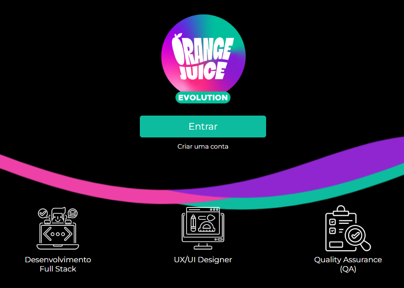

<h1 align="center"> Squad 33 | Orange Evolution </h1>

Projeto de front-end, desenvolvido para o Hackathon do processo seletivo da FCamara.

  <a href="#-tecnologias">Tecnologias</a>&nbsp;&nbsp;&nbsp;|&nbsp;&nbsp;&nbsp;
  <a href="#-projeto">Projeto</a>&nbsp;&nbsp;&nbsp;|&nbsp;&nbsp;&nbsp;
  <a href="#-layout">Layout</a>&nbsp;&nbsp;&nbsp;|&nbsp;&nbsp;&nbsp;
  <a href="#-desenvolvedores">Desenvolvedores</a>

 

  

## 🚀 Tecnologias

Esse projeto foi desenvolvido com as seguintes tecnologias:

- HTML e CSS
- JavaScript
- React
- Git e Github

## 💻 Projeto

 
A proposta apresentada foi criar uma plataforma própria do Orange Evolution, onde as pessoas possam ter acesso de forma mais organizada a trilha que escolheu, podem ver sua evolução conforme consome os conteúdos, e sendo tudo num mesmo lugar. 
A ideia é que essa plataforma seja o futuro da Orange Juice entrando mais afundo na formação de pessoas, criando cada vez mais seus próprios conteúdos e disponibilizando aos membros da comunidade em trilhas.
  

## 🔖 Layout

Você pode visualizar a ideia inicial do projeto através [DESTE LINK](https://www.canva.com/design/DAFQtyikT4c/fKTzrS4trAM8Dw-eYJzJ3Q/edit?locale=pt-BR&ui=eyJBIjp7IkUiOnsiQSI6dHJ1ZX19fQ).

## 💡 Desenvolvedores

Olivia | [Linkedin](https://www.linkedin.com/in/olivia-uesugui)

Renan | [Linkedin](https://www.linkedin.com/in/renan-leite-vieira-b81a85247/)

---
